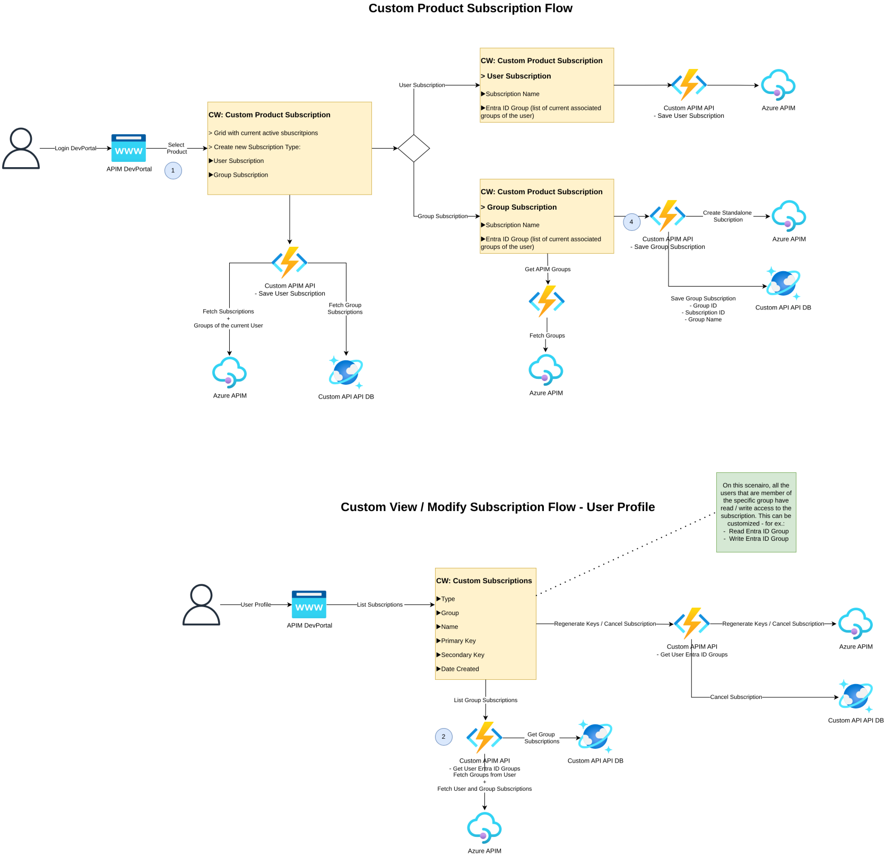

# AzureAPIMSubscriptionManagedByEntraIDGroup

Self-service **group subscriptions** for Azure API Management, where access to a subscription's
keys is governed by membership of an **Entra ID group** rather than by a single owner.

## Architecture

The diagram below is exported automatically from [docs/diagram.drawio](docs/diagram.drawio) by a GitHub Actions workflow whenever the source file changes.



### Azure resources

| Resource | SKU / Tier | Role |
|----------|-----------|------|
| API Management | **Developer** (Dev Portal enabled) | Developer portal + Custom API facade |
| Function App | Linux, **Consumption (Y1)**, .NET 8 isolated | Backend "Custom APIM API" |
| Cosmos DB | NoSQL, **Serverless**, `disableLocalAuth` | Group subscription store |
| Storage Account | Standard LRS | Functions runtime store |
| Application Insights + Log Analytics | Pay-as-you-go | Telemetry |

All service-to-service auth is **keyless** via **managed identity** + RBAC:

- Function MI → Cosmos DB (Built-in Data Contributor, data plane)
- Function MI → APIM (API Management Service Contributor, control plane)
- Function MI → Microsoft Graph (`GroupMember.Read.All`, `User.Read.All`)
- APIM MI → Function App (`authentication-managed-identity` policy)

## Repository layout

```
infra/        # Bicep IaC (main.bicep + modules)
src/          # .NET 8 isolated Azure Functions
.github/workflows/
  deploy-infra.yml   # Bicep deploy (OIDC)
  deploy-app.yml     # Function zip deploy (OIDC)
```

## Function endpoints

All endpoints require the caller to be a **logged-in APIM Developer Portal user**. The custom
widgets call the Functions directly and forward the user's APIM delegation SAS token plus the
`xmh-*` context headers (see [Dev Portal authentication](#dev-portal-authentication)); the Functions
reject any request that fails validation with **401**, and any cross-group access with **403**.

### Product & Max-Subscriptions enforcement

Subscriptions are created through the APIM **management API**, which — unlike the Dev Portal — does
**not** apply a product's settings. The create endpoints therefore enforce two product rules in the
backend:

- **A product is mandatory.** Every create request must carry a product scope (`/products/{productId}`).
  Requests with no product (or an `/apis` "All APIs" scope) are rejected with **400 Bad Request**.
- **The product's "Subscriptions limit" (Max Subscriptions) is respected**, independently **per user**
  and **per team/group**. For a product with limit N, each user may hold at most N subscriptions for that
  product, and each group may hold at most N. When the threshold is reached, creation is rejected with
  **409 Conflict** and a message explaining the rule and the limit. Products with no limit configured are
  unlimited.

| Method | Route | Purpose |
|--------|-------|---------|
| GET | `/api/users/{userId}/groups` | List the user's Entra ID groups (Graph). Only the authenticated user may read their own groups. |
| POST | `/api/user-subscriptions` | Create an APIM subscription owned by the authenticated caller (personal/user subscription). |
| GET | `/api/user-subscriptions` | List the APIM subscriptions owned by the authenticated caller. |
| POST | `/api/group-subscriptions` | Create standalone APIM subscription + persist record. Caller must be a member of the target group. |
| GET | `/api/group-subscriptions` | List subscriptions for the caller's groups (resolved server-side), enriched with current APIM keys. |
| POST | `/api/group-subscriptions/{entraIdGroup}/{subscriptionId}/{regenerate\|cancel}` | Regenerate keys or cancel. Caller must be a member of the group that owns the subscription. |

> **Note:** `GET /api/group-subscriptions` no longer accepts a `?groups=` query parameter — the
> caller's groups are resolved from the authenticated user, so a user can only ever see subscriptions
> for groups they belong to.

### APIM-group endpoints (Dev Portal not yet connected to Entra ID)

A parallel set of endpoints resolves group membership from the **APIM Groups** (built-in
`Administrators`/`Developers`/`Guests` plus any custom groups such as `Group1`/`Group2`/`Group3`)
instead of Entra ID. Use these when the Developer Portal is **not** federated with Entra ID. They are
backed by new `…Apim` Functions and an `ApimGroupService` that calls the APIM control plane via the
Function's managed identity (which already holds *API Management Service Contributor*) — no Graph
permissions required. The existing Entra-ID endpoints above are unchanged.

| Method | Route | Purpose |
|--------|-------|---------|
| GET | `/api/apim/users/{userId}/groups` | List the user's **APIM** groups. Only the authenticated user may read their own groups. |
| POST | `/api/apim/group-subscriptions` | Create standalone APIM subscription + persist record. Caller must be a member of the target APIM group. |
| GET | `/api/apim/group-subscriptions` | List subscriptions for the caller's APIM groups (resolved server-side), enriched with current APIM keys. |
| POST | `/api/apim/group-subscriptions/{group}/{subscriptionId}/{regenerate\|cancel}` | Regenerate keys or cancel. Caller must be a member of the APIM group that owns the subscription. |

> Both endpoint families share the same Cosmos container; the group identifier (an APIM group id like
> `Group1`, or an Entra group id) is stored opaquely in the record's group field. The custom widgets
> point at the `/api/apim/...` endpoints.


### Dev Portal authentication

Each request must carry:

| Header | Source (custom widget `secrets`) | Purpose |
|--------|----------------------------------|---------|
| `Authorization` | `secrets.token` | APIM delegation SAS token (`SharedAccessSignature token="{userId}..."`) |
| `xmh-userId` | `secrets.userId` | Dev Portal user id |
| `xmh-managementApiUrl` | `secrets.managementApiUrl` | APIM management API resource URL |
| `xmh-apiVersion` | `secrets.apiVersion` | APIM management API version |
| `xmh-origin` | `secrets.parentLocation.origin` | Dev Portal origin |
| `xmh-hostName` | `secrets.parentLocation.hostname` | Dev Portal hostname |

The `RequestAuthService` (in `src/GroupSubscriptions.Functions/Security`) validates that the SAS token
belongs to the claimed user, that the origin matches the configured Dev Portal (`DevPortal__Url`),
and — as the decisive proof — calls the APIM **management API** with the SAS token (only APIM can
validate a delegation token). Set `DevPortal__Url` to your portal URL (e.g.
`https://<apim>.developer.azure-api.net`); the infra deploy sets this automatically.

Because the Function App runs on the **Flex Consumption** plan — which ignores the platform-managed
CORS setting — CORS is enforced **in code** by `CorsMiddleware` and the `CorsPreflight` (OPTIONS)
function in `src/GroupSubscriptions.Functions`. Both echo the configured `DevPortal__Url` origin, so
keeping `DevPortal__Url` correct is what allows the browser widgets to call the Functions.

The three custom widgets that drive these flows live in [`src/widgets`](src/widgets/README.md).

## Prerequisites

- Azure subscription + an Entra ID tenant
- Azure CLI with the Bicep extension
- .NET 8 SDK
- A resource group (the infra workflow creates `rg-apimteam-dev` if missing)

### 1. Configure GitHub OIDC (no secrets)

Create an Entra app registration with a **federated credential** bound to this repo, then grant it
`Contributor` + `User Access Administrator` on the target resource group.

Add these **repository variables** (Settings → Secrets and variables → Actions → Variables):

| Variable | Description |
|----------|-------------|
| `AZURE_CLIENT_ID` | App registration (client) ID |
| `AZURE_TENANT_ID` | Entra tenant ID |
| `AZURE_SUBSCRIPTION_ID` | Target subscription ID |
| `APIM_PUBLISHER_EMAIL` | Publisher email for APIM |
| `AZURE_FUNCTIONAPP_NAME` | Deployed Function App name (from infra outputs) |

### 2. Grant Microsoft Graph permissions to the Function identity

After the first infra deploy, grant the Function App's **system-assigned managed identity** the Graph
**application** permissions `GroupMember.Read.All` and `User.Read.All` (required by the `GetUserGroups`
endpoint), then **admin-consent** them. This requires a directory admin and cannot be done in Bicep.

Example (run as a tenant admin; `MI_OBJECT_ID` is the Function App identity's principal/object id):

```bash
MI_OBJECT_ID=$(az functionapp identity show -g <rg> -n <function-app> --query principalId -o tsv)
GRAPH_SP_ID=$(az ad sp show --id 00000003-0000-0000-c000-000000000000 --query id -o tsv)

# App role ids: GroupMember.Read.All = 98830695-27a2-44f7-8c18-0c3ebc9698f6
#               User.Read.All        = df021288-bdef-4463-88db-98f22de89214
for ROLE in 98830695-27a2-44f7-8c18-0c3ebc9698f6 df021288-bdef-4463-88db-98f22de89214; do
  az rest --method POST \
    --url "https://graph.microsoft.com/v1.0/servicePrincipals/$MI_OBJECT_ID/appRoleAssignments" \
    --body "{\"principalId\":\"$MI_OBJECT_ID\",\"resourceId\":\"$GRAPH_SP_ID\",\"appRoleId\":\"$ROLE\"}"
done
```

After granting, restart the Function App so its managed-identity token picks up the new roles.

## Deploy

Deployment is split into two workflows, both triggered on push to `main` (or via
`workflow_dispatch`):

1. **deploy-infra.yml** — provisions all Azure resources with Bicep.
   > ⚠️ The Developer-tier APIM service takes ~30–45 minutes to provision on first run.
2. **deploy-app.yml** — builds and zip-deploys the Function App.

### Deployment notes & environment constraints

These reflect choices validated against a Microsoft-internal sponsored (MCAP) subscription; adjust for your own:

- **OIDC via User-Assigned Managed Identity** — if your tenant blocks app registrations
  (`ServiceManagementReference` required), use a UAMI with a federated credential
  (subject `repo:<owner>/<repo>:environment:dev`) instead of an app registration. `azure/login`
  works with either.
- **Region** — defaults to `northeurope` (West Europe had Cosmos zonal capacity constraints at deploy time).
- **Function hosting** — uses **Flex Consumption (FC1)**. Consumption (Y1) and Dedicated (B1) plans require
  `Microsoft.Web` "Total VMs" quota, which is 0 on some sponsored subscriptions.
- **Keyless storage** — the storage account has `allowSharedKeyAccess=false` (often enforced by policy),
  so the Function uses identity-based storage (`AzureWebJobsStorage__blobServiceUri` + deployment storage
  via `SystemAssignedIdentity`). The Function MI is granted Storage Blob Data Owner + Queue Data Contributor.
- **APIM operations** — the API uses **explicit operations** (not a `/*` wildcard, which did not match at
  the gateway). `subscriptionRequired` is `false` for the management API.

### Local development

```bash
cd src/GroupSubscriptions.Functions
cp local.settings.json.sample local.settings.json   # fill in your values
func start
```

> Local runs use your developer identity via `DefaultAzureCredential` (`az login`), so the same
> RBAC assignments must apply to your user for Cosmos/APIM/Graph calls to succeed.
